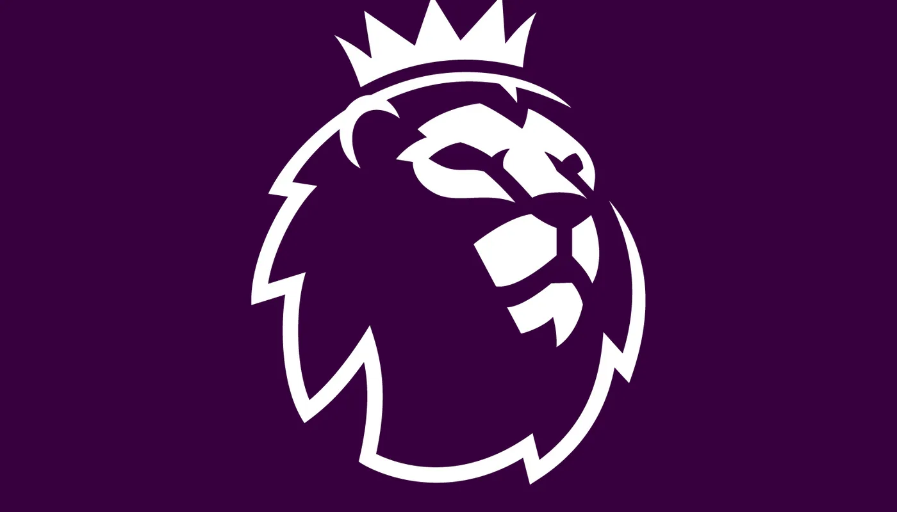
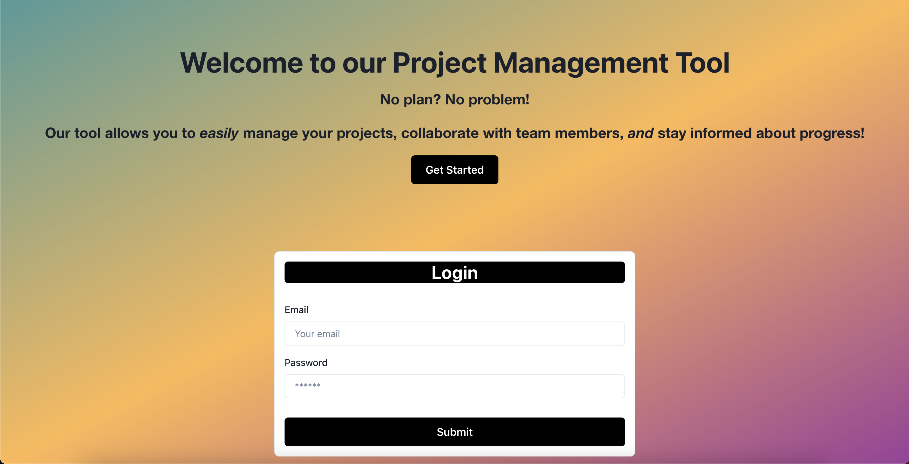

## Fantasy Premier League Tracker
Flask application that predicts the best Fantasy Premier League (FPL) picks for the upcoming gameweek based on OLS multiple regression model. Utilizes the FPL API to collect player and fixture data.
- 
- Tags: Category 1
- Badges:
  - Flask [gray]
  - Pandas [yellow]
  - Statsmodels [green]
  - Docker [blue]
  - AWS ECR [orange]
  - AWS Lightsail [orange]
  - Continuous deployment [gray]
  - GitHub Actions [purple]
- Buttons:
  - Live Site [https://fplanalyzer.r5jhhcf56mj9i.us-east-2.cs.amazonlightsail.com/]

## Wedding Website
I utilized Python and the Flask framework to develop a website for my upcoming wedding. The RSVP functionality allows the guests to submit their response, allergies, and a note to the couple. I also created a feature that sends a custom text to my cellphone with guests’ response when they RSVP. Lastly, I configured a virtual private server (VPS) as a web server and mail server using Nginx/Postfix.
- 
- Tags: Category 2
- Badges:
  - Python [blue]
  - Flask [gray]
  - MySQL [orange]
- Buttons:
  - Live Site [https://cindygiorgo.com]

## Project Management System
This application was created using the MERN Stack. This full functioning web application allows you to manage and organize your GitHub projects. Additionally, you can collaborate with team memebers and stay up to date with the current projects you are working on.
- 
- Tags: Category 3
- Badges:
  - JavaScript [yellow]
  - MongoDB [green]
- Buttons:
  - Live Site [https://calm-waters-92102.herokuapp.com/]

## Password Generator
Simple JavaScript application that generates a random password.
- 
- Tags: Category 4
- Badges:
  - JavaScript [yellow]
  - HTML [red]
  - CSS [blue]
- Buttons:
  - Live Site [https://gkaramanis1.github.io/password-generator/]

## Work Day Scheduler
Simple JavaScript application that allows the user to create an hourly schedule for the current day.
- 
- Tags: Category 3
- Badges:
  - JavaScript [yellow]
  - HTML [red]
  - CSS [blue]
- Buttons:
  - Live Site [https://gkaramanis1.github.io/day-scheduler/]

